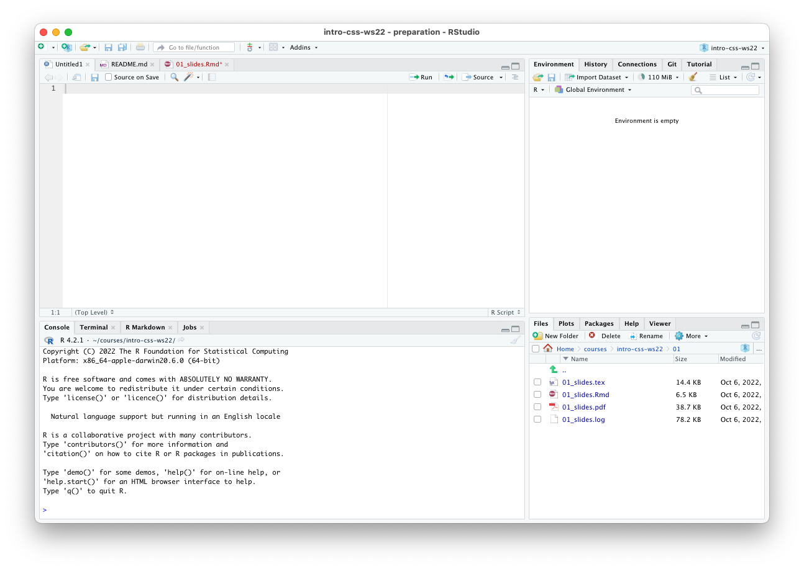

# Introduction {.centered}

\begin{centering}

\Large\textbf{Who are we?}

\Large\textbf{Who are you?}

\end{centering}

# What is this course about?

\smaller

- ***Introduction*** to ***Computational Social Science***

- We want to provide an overview of current computational techniques used in Political Science research

- You might not be able to perform each and every one of these techniques (but we will provide examples!) after the course, but you (hopefully) will have a better understanding of the logic behind them and their limitations as well as the tools used.

- Examples and coding!

**Note:** We may sometimes use terms that you are not familiar with. In general, we will try to be mindful and explain them, but we might not always realize a term is unfamiliar -- so don't hesitate to stop us and ask!

# Syllabus {.c}

\textbf{The syllabus and all course materials can be found on https://github.com/ghxm/intro-css-ws22}

# Course overview i

**Why double sessions?**

1. Presentation / background
2. Lab

# Course overview ii {.shrink .c}

**Session 1 (today)** Introduction, What is CSS, R?

**Session 2** Data structures, data collection and research design + term paper details

**Session 3** Introduction to text analysis

**Session 4** Supervised machine learning for text analysis

**Session 5** Introduction to network data

**Session 6** Introduction to geo-spatial data + guest lecture!

**Session 7** ? (See syllabus)

**Session 8** Term paper presentations, closing discussion

# Course requirements

**Requirements**

1. **Presentation of your paper idea for the term paper** \newline
To get feedback from students and instructors.

Presentations will be held in the final session.

2. **Term paper** \newline
Details will be provided throughout the course / in the next session.

# Office hours et al.

See syllabus.

Don't hesitate to make use of the office hours! (Just write an e-mail beforehand)

# Questions? {.c}

\LARGE ... any questions so far?

<!---- CONTENT START ----->

# What is Computational Social Science? {.allowframebreaks}

>The new field of Computational Social Science can be defined as the interdisciplinary investigation of the social universe on many scales, ranging from individual actors to the largest groupings, through the medium of computation.
[@intro_css_book_2017]

\framebreak

>We define CSS as the development and application of computational methods to complex, typically large-scale, human (sometimes simulated) behavioral data. [@lazer_computational_2020]

\framebreak

>Computational Social Science (CSS) is the science that investigates social and behavioral dynamics through social simulation, social network analysis, and social media analysis. (Computational Social Science Society of the Americas)

\framebreak

- No clear definition! (This does not need to be a bad thing!)

- vs. Data Science? Data Engineering? Programming? AI? Statistics? Big data? Algorithms?

# Example: What do we do? {.c}

**EUPLEX dataset**

- contains information on all legislative procedures in the EU 1994 -- present and
- information on the complexity of their proposal texts
- information is automatically downloaded, analyzed and packaged as a dataset

# What CSS might be {.allowframebreaks}

**Some examples of CSS techniques in action**

- [Explore the social dynamics of COVID-19 transmission](https://www.nature.com/articles/s41586-021-03694-x) and [evaluate policy responses](https://www.google.com/covid19/mobility/)
- [Investigate the strategies firms use to undermine anti-pollution laws](https://papers.ssrn.com/sol3/papers.cfm?abstract_id=3915247)
- [Analzye electronic health records without breaching doctor-patient confidentiality](https://pubmed.ncbi.nlm.nih.gov/32167919/)
- Get 'smart' answers from Google / Siri / etc.
- [Find out which Spiegel Online authors like to flirt in the workplace](https://www.youtube.com/watch?v=-YpwsdRKt8Q)
    

\framebreak

**Some examples from Political Science**

- Explore how polarized MPs are in the German Bundestag (we will do this in the course!)
- Analyse who politicians talk to on Twitter
- Automate your media analysis
- @TODO

\framebreak

**Examples from the CSS toolkit**

- Programming languages
- Scientific writing
    - Reproducible reports
    - Interactive research papers
- Literature research
    - [Elicit](www.elicit.org)
- Version control

\framebreak

## Working definition of 'Computational Social Science' {.c}
    
All kinds of computer-aided methods and techniques of data collection, analysis and inference in the Social Sciences that go beyond pure statistics.

# Programming in the Social Sciences

**Examples of programming languages**

- Python
- Julia
- JavaScript
- **R** (Why?)
- *Do you have any experience with any programming language?*

# Why `R` {.allowframebreaks}

- `R` is a programming language for statistical computing
- Widely used in science
- Almost 30 years old
- Can be easily integrated into a paper writing workflow

# Learning `R` {.allowframebreaks}

- You will not need to become an `R` pro or understand every line of code in order to follow the course. It is sufficient to keep some basics in mind (coming right up in the lab).
- `R` is just the tool we use to do what we aim to do, so we need to get some boring stuff out of the way first :)

- Sometimes it's more important to understand what is happening and why it is happening rather than being able to translate it into code.
- We will help you and always provide examples!
- Don't hesitate to ask!

# Learning `R`: it's not just you! {.allowframebreaks}

\begin{centering}

\includegraphics[height=0.7\textheight]{res/learn_r.jpeg}

\smaller
\smaller

\vspace{-1.8em}

Source: https://twitter.com/chrisbeeley/status/727945556128059396

\end{centering}

# Next: Lab

You can download the lab file from the [course repository on GitHub](https://github.com/ghxm/intro-css-ws22)

1. Setting up a development environment
2. Introduction to R and RStudio
3. How to find help

# Excursion: What are `git` and GitHub {.shrink}

\smaller

**`git`**

- Version control system (VCS): a system used to manage and track changes to your documents
- allows for easy collaboration on coding projects

It may take some time to work with a VCS, but there are [`git` quickstart tutorial](https://rogerdudler.github.io/git-guide/)s on the internet to help you ease in.

**GitHub**

- an online version of `git`
- you can easily make your projects public
- and invite others to contribute to your project

As a student, you can [set up a free GitHub account](https://github.com/signup) with all the features of a pro account!

**Important:** You will not need to use `git` to follow the course, but you may!

# Setup

To work with R in the course, we will be using a program, a so-called integrated development environment (IDE), called RStudio. You can either

- use RStudio Cloud in the browser (registration required, but free to you) or
- [download RStudio](https://www.rstudio.com/products/rstudio/download/#download) and install it on your computer or
- use the university computers

# RStudio GUI

# References 

\begingroup

\footnotesize
::: {#refs}
:::
\endgroup

# Appendix {.allowframebreaks}

