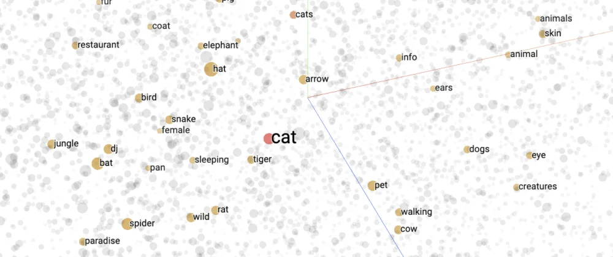
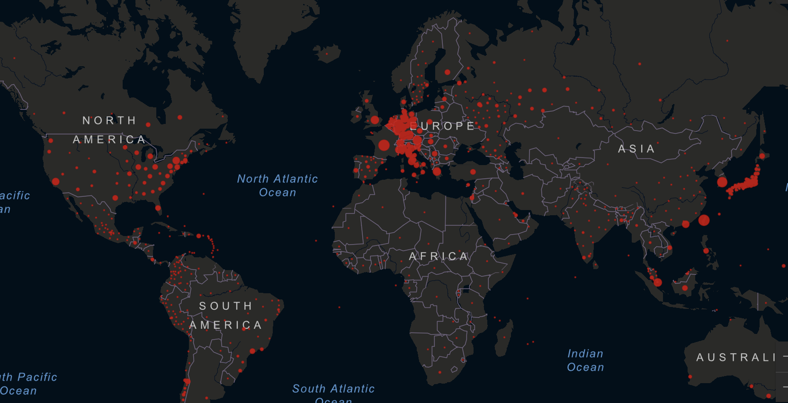
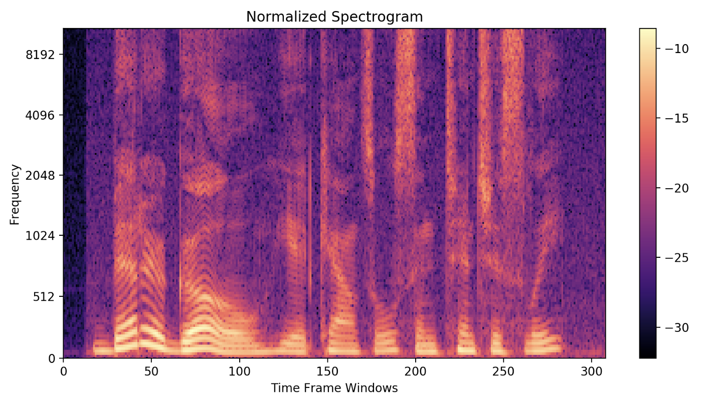
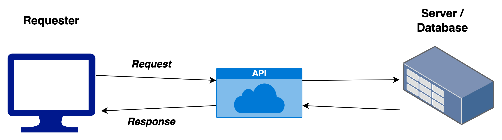
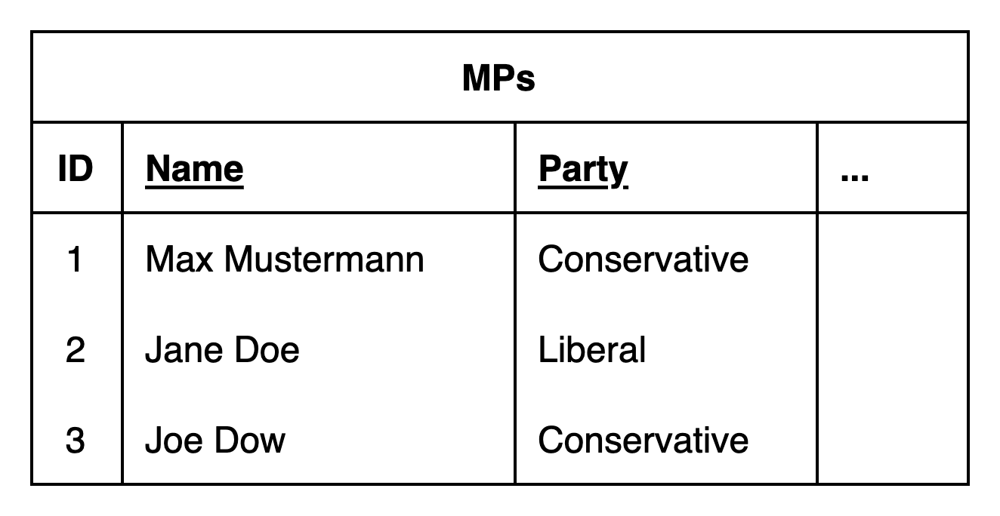
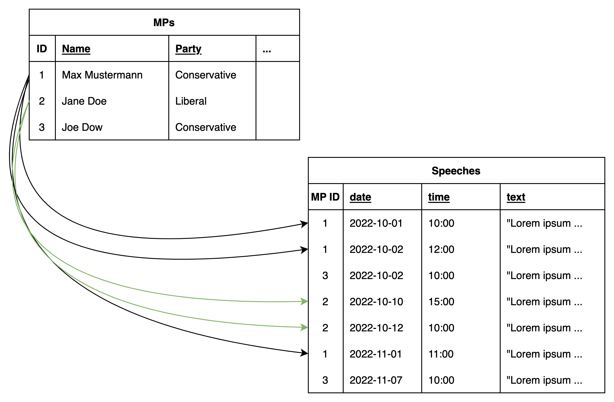

# Today's session {.centered}

**Lecture**

1. Data types
2. Data collection and storage
3. Working with data & reproducibility

**Lab**

1. Data types in `R`
2. API
3. Web-scraping

#

<!--- DATA ---->
\section{Data}

# "Data"

**What is *data*?** \pause

&rarr; *Information that has been translated in a way that makes it accessible for further processing or inference.*

\vspace{0.8em} \pause

**Problem:** information / data is not always available in a readily accessible way

&rarr; We need to *collect* and *store* it in a way that is useful for us

# Types of data

\smaller

**Structured data** highly organized and easily accessible, easily searchable

&uarr;

Typical Social Science 'datasets'

News paper article metadata

Social media user data

Newspaper articles

Multimedia files

&darr;

**Unstructured data** raw and uncategorized, hard to access and search

# Our syllabus

- Text data (&rarr; Sessions 3 & 4)
- Network data (&rarr; Session 5)
- Geo-spatial data (&rarr; Session 6)

&rarr; **Goal:** Transform raw, unstructured, abstract data into a structured, machine-readable format

# Text data (&rarr; Sessions 3 & 4) { .allowframebreaks .squeeze }

\smaller

**Example**

\vspace{-0.2em}

Newspaper articles, laws, tweets

**Raw**

\vspace{-0.4em}

- Text documents in digital form (in files, strings, PDFs, Word files, online)

**Processed**

\vspace{-0.4em}

- Bag of words, TF-IDF
- Annotated text
- Word embeddings (word2vec, Transformers)

**Goal**

\vspace{-0.4em}

- Content analysis, extract information (e.g. events, sentiment)
- Compare texts (e.g. cosine similarity, minimum edit distance)

\framebreak

\smaller

Source: https://openclassrooms.com/en/courses/6532301-introduction-to-natural-language-processing/6980811-apply-a-simple-bag-of-words-approach

\framebreak

Source: https://medium.com/in-pursuit-of-artificial-intelligence/named-entity-recognition-using-spacy-ner-da6eebd3d08

\framebreak

Source: https://dev.to/jinglescode/word-embeddings-16hb

# Network data (&rarr; Session 5) {.allowframebreaks .squeeze}

\smaller

**Example**

Discourse networks on twitter, information exchange across bureaucracies

**Raw**

Social network websites, Surveys

**Processed**

- (API data, metadata)
- Network matrix

**Goal**

- Trace communication and connections between entities (nodes)

\framebreak

::: {.centering data-latex=""}

{ height=75% }

\smaller 
\smaller

\vspace{-1em}

Source: https://datascience.blog.wzb.eu/2019/07/11/a-twitter-network-of-members-of-the-19th-german-bundestag-part-ii/

:::

# Geo-spatial data (&rarr; Session 6) {.allowframebreaks}

\smaller

**Example**

Addresses, names of towns, mountains, routes

**Raw**

Names of places

**Processed**

- Coordinates

**Goal**

- Extract location-related information (distance, area)

\framebreak

\smaller

Source: https://coronavirus.jhu.edu/map.html

# Multimedia data {.allowframebreaks}

\smaller
\smaller

**Example**

\vspace{-0.5em}

Images, videos, audio recordings

**Raw**

\vspace{-0.5em}

- Images, audio, video files

**Processed**

\vspace{-0.5em}

- File properties / metadata
- Color, sound information, spectograms
- Pixel / frequency information

**Goal**

\vspace{-0.5em}

- Extract information regarding the content (presence / movement of a person / object) of an image
- Extract information about the loudness or pitch of an audio sample
- Speech to text, text recognition

\framebreak

\smaller

Source: https://towardsdatascience.com/understanding-audio-data-fourier-transform-fft-spectrogram-and-speech-recognition-a4072d228520

\framebreak

::: {.centering data-latex=""}

{ height=80% }

\vspace{-3em}

Source: https://www.analyticsvidhya.com/blog/2021/03/grayscale-and-rgb-format-for-storing-images/

:::

# 'Digital trace data'

\smaller

**Example**

Logs of users of an app and their activities in the app; visitors of a website; social media likes and comments; heart rate sensor data

**Raw**

- many forms depending on the kind of trace (see previous)

**Processed**

- various forms (see previous)

**Goal**

- Extract information

# Note on data types {.c}

**Note:** One type of data is not exclusive to a particular analysis!

Many types of data are often combined, e.g.

- obtain digital trace app data, create a network
- analyze exchanged message text data
- use content of messages to inform the kind of connection between network nodes

# Some data terminology i

**Data point / observation**

\vspace{-0.8em}

*One or more attributes of a single unit, e.g. the name, height and age of one student*

\pause

**Dataset**

\vspace{-0.8em}

*Multiple data points / observations, e.g. the name, height and age of all students in a course*

\pause

**Subset**

\vspace{-0.8em}

*A 'part' of a collection of elements, e.g. the first 5 students in our dataset, all students in our dataset taller than 180cm*

# Some data terminology ii

**Population**

\vspace{-0.8em}

*Entire group of units, e.g. all students from all over the world*

\pause

**Sample**

\vspace{-0.8em}

*A subset of a population, e.g. the students in a particular course, the students you met at the last uni party*

# Ways to collect / obtain "data"?

- Surveys
- Measure / Annotate (potentially *crowdsourced*)
- *APIs*
- *Webscraping*
- Use already collected data(sets)
- Simulate data

# Crowdsourcing data [@uwe_engel_crowdsourcing_2022]

\smaller

Instead of collecting and annotating data themselves (or to conduct surveys and experiments), researchers increasingly rely on online crowdsourcing platforms where workers can sign up and receive compensation for tasks (e.g. *Amazon MTurk*).

**Pros**

- reduced cost
- instant recruiting and timely completion
- more diverse samples than student samples

**Cons**

- workers tend to exhibit certain characteristics
- data quality (profiles, attrition, responses)
- workers are used to surveys / experiments and talk to each other
- ethical aspects (compensation, rejection, privacy)

# APIs {.allowframebreaks}

\smaller

**Application Programming Interface (API)**: an access point with specific rules and procedures to interact with a program / database

&rarr; commonly used to facilitate exchange between multiple applications / databases
&rarr; in research: Web APIs

**REST APIs**

*Representational State Transfer (REST)* are a particularly common type of APIs that adhere to a common style. IT can be used to retrieve data (GET), update (PUT), create (POST) and remove (DELETE) data.

&rarr; for research purposes we usually want to retrieve data from an online resource (e.g. Wikipedia, Twitter, Facebook, Parliaments)

&rarr; to retrieve data from an API, it needs to be *requested*

We will learn how to use an API with the help of an `R` package in today's lab!

\framebreak

# Webscraping

**Webscraping**: extracting information from websites using automated tools

&rarr; can relate to any kind of information: texts, images, videos 'data', links, metadata

**Web crawling**: automated and systematic browsing of websites to store relevant information, follow links etc.

**Example workflow**

1. 'Request' / open the website
2. Locate the required information on the website (usually in it's *code*)
3. Store the information

# Data structures

**Data scructure**: the way in which data is represented or organized

**Value types**

- *integer* / float (numeric values)
- *strings* (text values)
- *boolean* (True / False values)

**Structures**

- *Vector / Array* (a series of values with $n$ dimensions, for vectors $n = 1$)
- *Data frame* (list of vectors &rarr; rows / columns)

*There are many more structures depending on the programming language and use case but these will suffice for now!*

# Data storage

There are many ways to store collected data. Often, the type of storage is determined by the type of data and its level of structure.

**Data storage examples**

- Plain files
- Structured files (e.g. csv)
- Structured databases (SQL; table-style organization and searchable)
- Unstructured databases (NoSQL; document-style, organization can vary by document)

# Storage of structured data

**Examples**

- Dataset (table) of survey responses
- Dataset (table) on MPs, their characteristics and their activites

*could be stored as*

- structured Files (e.g. csv)
- table in an SQL database

# Side note: Flat vs. relational data i {.allowframebreaks}

## "Flat data"**

All information is contained in a single table, e.g. MPs and data on their age, party, gender and marital status

## Relational data

Information is stored in multiple tables that relate to each other, e.g. one table on MPs and their characteristics and one table on their activities (e.g. speeches)

# Side note: Flat vs. relational data ii

# Side note: Flat vs. relational data iii

# Storage of unstructured data

**Examples**

- News paper articles
- Raw scraped website HTML
- Data from ongoing data collection with yet unknown scope

*could be stored in*

- Plain text files
- Document (NoSQL) Databases

<!---->

# Ethical aspects & data [based on @matthew_j_salganik_bit_nodate]

\smaller

When collecting and analyzing data using computational tools, it's very easy to collect a great variety of data. However, just like research without computational tools, there are a few ethical standard to keep in mind when doing so.

**Respect 'do no harm'** e.g.

- Bandwidth and server load when web-scraping &rarr; spread out collection over time
- Treatments in experiments and (unintended) consequences (mood change due to modified Facebook feed) &rarr; informed consent

**Legal aspects** e.g.

- Data privacy &rarr; anonymization
- Content behind a paywall /restricted access &rarr; read Terms of Service
- Copyrighted content &rarr; check licensing; do not share raw data

<!--- WORKING WITH DATA -->

#

\section{Using data in research}

# Types of analyses [@john_wilder_tukey_exploratory_1977] {.allowframebreaks .c}

<!--- https://stats.stackexchange.com/questions/471253/exploratory-vs-descriptive-statistical-analysis ---->

\smaller
\smaller

**Exploratory**

&rarr; *Analysis that aims at inspecting and summarizing data (often in a visual way) to inform (later on) confirmatory analysis, discover patterns, generate hypotheses, provide a basis for further data collection*

**Descriptive**

&rarr; *Summaries of data using statistical techniques (common statistics include mean, median, mode, variance)*

**Confirmatory / Explanatory**

&rarr; *Analysis that aims at making inferences about the greater population population of data*

**(Predictive)**

&rarr; *Analysis that uses data from a population to make predictions about the future*

# Types of analyses: Examples {.allowframebreaks}

\smaller
\smaller

**Exploratory:** Collecting 5000 newspaper articles from the New York Times to get an idea of how long it takes to collect them, what we can infer from the texts (topics? number of authors? positioning?)

**Descriptive:**

- Collecting all newspaper articles (e.g. from the Politics section) from the NYT and summarize how many are published per quarter on average, what the most written about topic is by year
- Evaluating the responses to a vote intention survey by household income or education to get an overview of how voting preferences are distributed among the respondents

**Confirmatory:**

- Use data on all NYT Politics articles to test your hypothesis about a bias in political reporting during election time
- Test what characteristics make people more likely to vote for the ruling party

**Predicitve:** Use the reading / comment / click statistics of NYT articles to recommend articles to readers that they might also find interesting

# Types of analyses in Political Science {.c}

&rarr; When working with newly obtained or unstructured data, it is often helpful to engage in descriptive and exploratory analysis first to get a feel for the data and the ways in which you might be able to use them

&rarr; Most Political Science research is focused on confirmatory analysis; however good exploratory and descriptive analysis is often helpful in making data accessible and generating ideas for yourself and other researchers!

<!--- REPRODUCBILITY --->
# Reproducibility

**Reproducibility**

*Ability to repeat an analysis and obtain the same results*

\vspace{1em}

This can be related to

- new or re-collected data / new experiment under same conditions / new method
- *same code and / or data*

# The 'Replication crisis'

In recent decades, many studies have been found to be impossible to reproduce due to

- lack of transparency wrt. how data was collected and/or data not made available
- in how data was collected or analyzed and code not made available

&rarr; Many scientific journals now require authors to publish their data and code alongside their articles and their analysis to be reproducible

# Reproducbility: core principles [@p_ball_task_2016; @p_ball_principled_2016; @uwe_engel_reproducbility_2022]

1. **Transparency:** Analysis parts are complete and sufficiently documents
2. **Auditability:** Analysis can be executed by other researchers or on different platforms
3. **Reproducbility:** Results are the same for anyone running the analysis using the same code and data
4. *Scalability*: Code can handle other inputs and outputs than those used in the specific project

# Reproducibility: What does this mean for us? {.allowframebreaks}

\smaller
\smaller

***Share your full code and data +***

**Transparency**

\vspace{-1em}

- write and store code in a way that is easily understandable for others (within reason)
- include all parts of code (incl. for figures, tables)
- document files, code and your data collection process

**Auditability**

\vspace{-1em}

- include every step of the process (package dependencies, environment settings) in your code
- make sure the analysis can be run in a newly set up environment

**Reproducibility**

\vspace{-1em}

- taking **transparency** and **auditability** into account, make sure your results remain stable when re-running your analysis

*Scalability* (within reason and your own ability)

\vspace{-1em}

- try to write generalized rather than highly specific code

# Side note: Data repositories

In addition to journal websites, *data repositories* are a great way to share your research code and data.

One of the most popular ones in the Social Sciences is [Harvard Dataverse](https://dataverse.harvard.edu/).

An overview can be found on [dataverse.org](https://dataverse.org/).

<!--- TERM PAPERS -->

# Outlook {.c}

&rarr; **Session 7** will be dedicated to performing a complete analysis and writing a term paper!

\vspace{2em}

**Next session** Text data

#

\section{Lab}

# References 

\begingroup

\footnotesize
::: {#refs}
:::
\endgroup

# Appendix {.allowframebreaks}

