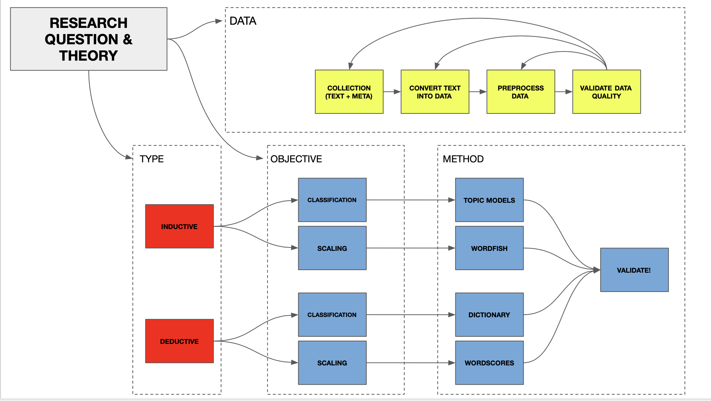
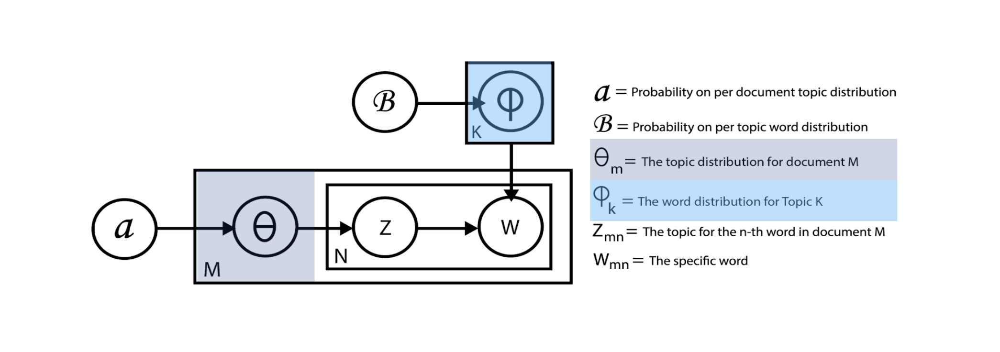
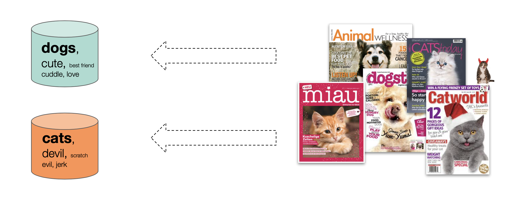
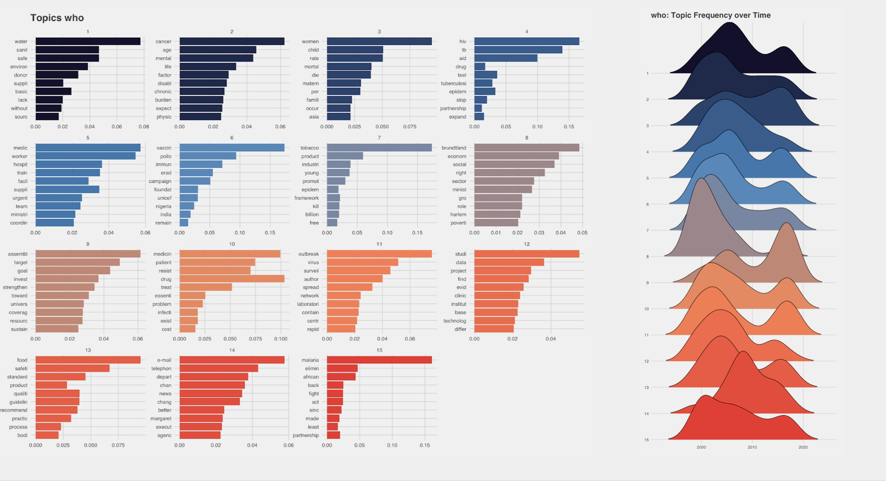
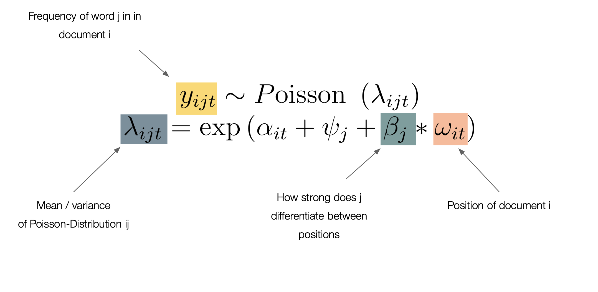
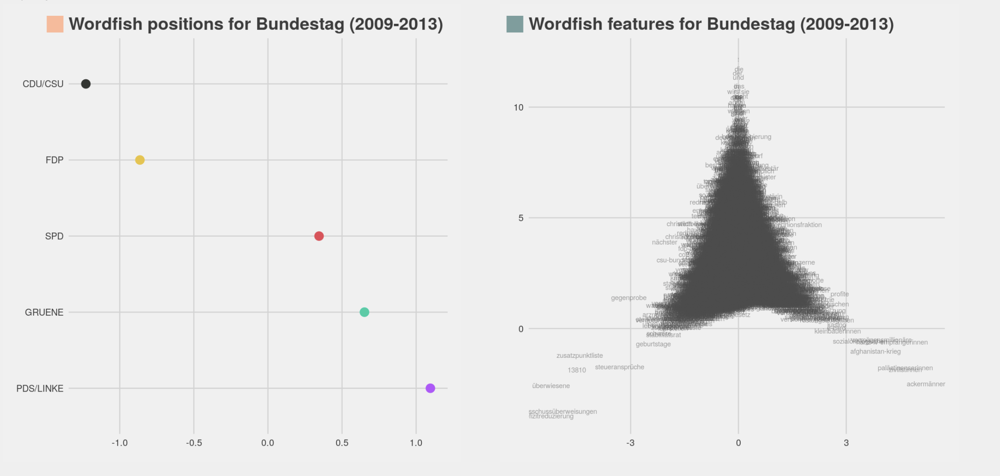

# Today's session {.centered}

**Lecture**

1. Text data
2. Dictionary
3. Scaling models
4. Topic models

**Lab**

1. How often do MPs in the Bundestag talk about environment?
2. How do parties position themselves in speeches?
3. What are the main topics of debate?


#

<!--- DATA ---->
\section{Why text?}

# Sources

Often times political action has a text trail:

- Political speeches and debates are transcribed
- Laws are written down
- Opinions are expressed in written form (Twitter, press releases)

# Opportunity

Using computational social sciences methods allows us to:

- Collect and analyse vast amounts of preexisting text data
- Without the huge costs associated with manual coding

# Principles

From Grimmer & Stewart (2013):

1. All quantitative models of language are wrong—but some are useful. 
2. Quantitative methods for text amplify resources and augment humans. 
3. There is no globally best method for automated text analysis.
4. Validate, Validate, Validate.

#
\section{From text to data}

# Text

- Text is immensely complex
- First step in most text analysis process is finding a way to represent text as data

# Some lingo:

- **Document**: Often times the unit of analysis, therefore one unique text
- **Corpus**: A collection of documents
- **Meta data**: Additional data that describes each document, e.g. its release date

# Text as data

We can differentiate roughly two text representation forms:

- **sparse** (many zeros, or less abstract)
- **dense** (few zeros, or more abstract)

# Bag-of-words

The most common form of representation is **bag-of-words**:

Given a collection of documents, thus a corpus,

1. List each *unique* word occurring across all documents in the corpus (-> **vocabulary**)
2. Count how often each word appears for a given document
3. Create a vector from the counts


# Bag-of-words: Example
Text:

- We prefer policy option one over policy option two.

Becomes:

| We | prefer | policy | option | one | over | two | . |
|----|--------|--------|--------|-----|------|-----|---|
| 1  | 1      | 2      | 2      | 1   | 1    | 1   | 1 |

# Bag-of-words: Limitation

Text:

- We prefer policy option one over policy option two.
- We prefer policy option two over policy option one.

Becomes:

| We | prefer | policy | option | one | over | two | . |
|----|--------|--------|--------|-----|------|-----|---|
| 1  | 1      | 2      | 2      | 1   | 1    | 1   | 1 |
| 1  | 1      | 2      | 2      | 1   | 1    | 1   | 1 |

# Bag-of-words: Limitation
- Problem: Bag-of-words is often unable to depict the **meaning** of a text. 
- Reminder: "All quantitative models of language are wrong—but some are useful."
- Possible solution: Abstract (dense) representation of texts based on more complex models (e.g. Transformers)

# Preprocessing text

A short word on pre-processing:

**Problem**:

- Textual data is often messy!
- Messy data is very problematic when it comes to drawing conclusions from your analysis

**Common issues**:

- Formatting issues 
- Unwanted inclusions
- Punctuation
- Different inflections (playing, play, player)
- Words without much information (stopwords)

# Preprocessing text
**Possible solution(s)**:

- Stemming and lemmatization (removing/reducing inflections)
- N-grams
- Reduction of vocabulary (e.g. removing very common and very rare words)
- Removing special characters (punctuation, numbers, etc.)
- ...

**Important**

- Always control which impact your pre-processing has on the final results!
- Always inspect your text manually!

#
\section{Analysing text data}

# Overview



# Type

**Inductive** 

- No prior deeper understanding of the subject matter

**Deductive**

- Profound understanding of the subject matter


# Objective

**Classification**

- Assign values or labels to unlabeled data

**Scaling**

- Place observations within a space (e.g. on a left-right scale)

#

\section{Dictionary}


# Dictionary

**Goal**: 

- Classifing documents into *known* categories

**Basic idea**:

1. Define a list of words that is connected to a concept that you want to measure
2. Count how often the predefined words appear in each document
3. Construct measure based on matches

# Dictionary: Example Sentiment analysis

\footnotesize
````{R}
library(tidytext)

get_sentiments("bing") 
````

# Dictionary: Example Sentiment analysis

\footnotesize
````{R, message=FALSE}
library(tidytext)
library(tidyverse)

reviews <-
  data.frame(
    text = c(
      "I think this class was amazing. 
      The lecuteres were absolutely fantastic!",
      "What a waste of time. 
      Never before have I been this disappointed"
    ),
    student = c(1, 2)
  )
````

# Dictionary: Example Sentiment analysis

\footnotesize
````{R, message=FALSE}

reviews %>% 
  unnest_tokens(word, text) %>%
  inner_join(get_sentiments("bing"))

````

# Dictionary: Example Sentiment analysis

\footnotesize
````{R, message=FALSE}

reviews %>% 
  unnest_tokens(word, text) %>%
  inner_join(get_sentiments("afinn"))

````

# Dictionary: Example Sentiment analysis

\footnotesize
````{R, message=FALSE}

reviews %>% 
  unnest_tokens(word, text) %>%
  inner_join(get_sentiments("nrc"))

````
# Dictionary: Example Sentiment analysis

Word Count:

$$Sentiment_i = \sum P_i - \sum N_i$$

The sum/number of postive words P from a document i minus the sum/number of negative words N for a document i.

# Dictionary: Example Sentiment analysis

Relative Word Count:

$$Sentiment_i = \frac{\sum P_i - \sum N_i} {\sum W_i}$$

The sum/number of postive words P from a document i minus the sum/number of negative words N for a document i divided by the total number of words W.

# Dictionary: Example Sentiment analysis

Including confidence:

$$ Sentiment_i = \frac{\sum P_{i,m} * C_{i,m} - \sum N_{i,m} * C_{i,m}}{\sum W_i} $$ 

For the sum of postive words P from a document i multiplicated by the confidence for each word m that it represents a postive word...


# Dictionary: Postives and negatives

**Positive**

  - Very simple
  - Often easy to connect to theoretical framework (deductive!)
  - High precision

**Negative**

  - Often low recall
  - Difficult to construct dictionaries that capture every variation of the concept

#
\section{Topic models}

# Topic models

**Goal**: 

- Classify documents without knowing the categories beforehand

**Basic idea (in this case simplyfied)**:

1. Documents are created by repeatedly drawing words that belong to a limited amount of topics
2. Each topic represents a distribution of words
3. Each document represents a distribution of topics
4. We can infer from which topic words "originated" based on their concurrence
5. We can infer the distribution of topics across a document

# Topic models: Closer look


# Topic models: Basic idea simplified...


# Topic models: Example


# Topic models: Postives and negatives

**Positive**

  - Can give a quick **explorative** overlook over the contents of your text data
  - Possibility to include further parameters into the estimation (structural topic models)
  - Can be used for other means -> matching

**Negative**

  - Difficult to connect to theory
  - Uncertainty what exactly is measured
  - Rely on many hyper parameters
  - Very senstitive to input

#
\section {Scaling models: Wordfish}

# Wordfish

**Goal**: 

- Placing actors on/along a predefined dimension, without knowing their position beforehand

**Basic idea**:

1. Language is marked by ideology
2. Political actors differ how they talk about issues and which issues they talk about
3. By finding *discriminating* words we can place actors along a scale based on the words they use


# Wordfish: Model


# Wordfish: Results example


# Wordfish: Positive and negatives

**Positives**:

- Intuitively results make sense
- Results in a continues measure of ideology

**Negatives**:

- Strong assumptions (unidimensional issue space, ideological language, naive bayes)
- Weak performance when used outside of party manifestos and speeches
- Very specific use case

