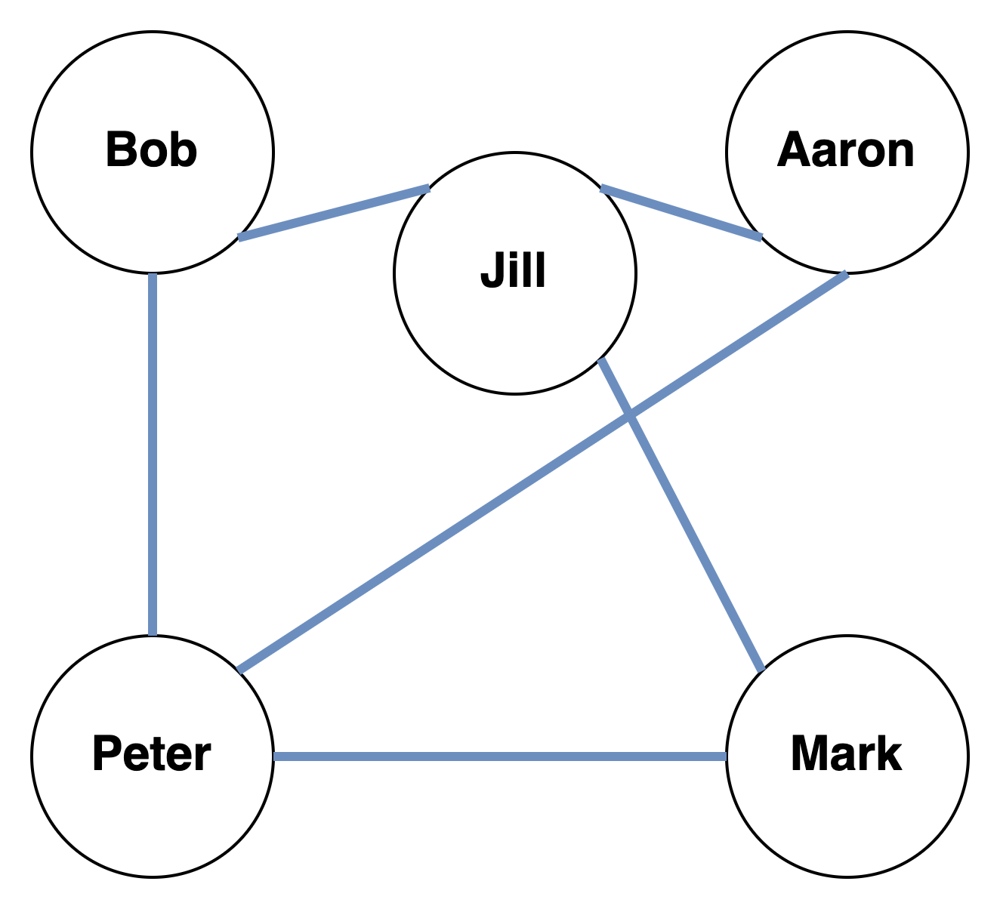
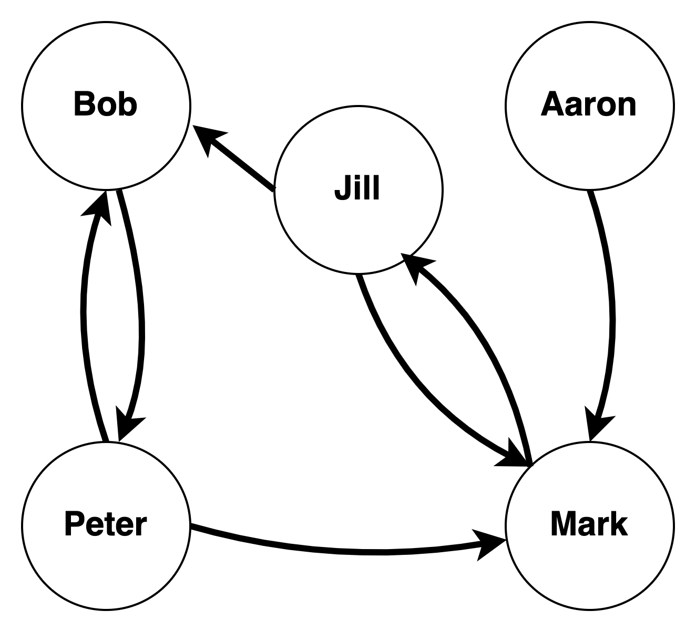

In this lab session, we will quickly give ChatGPT a try and then dive into network analysis in `R` using the `igraph` package.

We've already discussed ChatGPT in the lecture So let's check it out quickly.

To use it during the free research beta, you can [sign up with OpenAI](https://chat.openai.com/).

What's cool is that we can also ask it to write `R` code for us.

While this is a and can help us if we get stuck or need to get started, it is important to note that these types of *language models* cannot actually reason or understand things independently, they only learn relationships between words, so be careful!


# Network basics in `igraph`

The `igraph` package provides a comprehensive suite of functions for creating and analyzing complex network data. We will start out by covering the basics of using `igraph` to create and visualize networks, compute important network statistics, and manipulate and analyze network data.

First, let's start by installing and loading the `igraph` package in R:

```{r, eval=FALSE}

install.packages("igraph")

```


In addition to `igraph`, we will also load the `dplyr`package.^[Note: we could also load the entire `tidyverse` here but since we only need some functionality, so we'll stick to `dplyr`.]

```{r}

library(igraph)
library(dplyr)

```


## Our first network^[Parts of this section are inspired by Mark Hoffman's course '[Methods for Network Analysis](Methods for Network Analysis)' which is also a great resource for network anaylsis in `R`.]


Let's consider a network this network of friends.




Next, we can start translating this into code. We will start with a `data.frame` that has two columns to represent the friends.

```{r}

personA <- c("Bob", "Bob", "Aaron", "Aaron", "Mark", "Mark")
personB <- c("Peter", "Jill", "Jill", "Peter", "Jill", "Peter")

edges <- data.frame(
  personA,
  personB
)

```


Let's take a look at the `data.frame` we created:

```{r, eval=FALSE}

View(edges)

```


We can use this list of edges to create a network with the `graph_from_data_frame` function:

```{r}

g <- graph_from_data_frame(edges, directed=FALSE)

```


Now that we have a network, we can use the `plot` function to visualize it. By default, the `plot` function will use a force-directed layout to arrange the nodes in the network, resulting in a visually pleasing and easy to interpret plot:

```{r}

plot(g)

```


Now, let's consider a directed graph. These are the texts the friends sent over the weekend:




A directed edge means that someone reached out to someone over the weekend. Let's start importing this into `R`:

```{r}

sender <- c('Bob',  'Peter', 'Peter', 'Jill', 'Jill', 'Aaron', 'Mark')
receiver <- c('Peter', 'Bob', 'Mark', 'Mark', 'Bob', 'Mark', 'Jill')

messages <- data.frame(sender, receiver)

gm <- graph_from_data_frame(messages)

plot(gm)

```


Alternatively, we can also create a network from an adjacency matrix, which is a matrix that encodes the connections between nodes in a network. To create our network from an adjacency matrix in `igraph`, you can use the following code:


```{r}

# Create an adjacency matrix
adjmat <- matrix(
  c(0, 1, 0, 0, 0,
    1, 0, 0, 0, 1,
    1, 0, 0, 0, 1,
    0, 0, 0, 0, 1,
    0, 0, 1, 0, 0),
  nrow = 5,
  ncol = 5,
  dimnames = list(c('Bob', 'Peter', 'Jill', 'Aaron', 'Mark'), # rows
                  c('Bob', 'Peter', 'Jill', 'Aaron', 'Mark')), # columns
  byrow = TRUE
)

# Convert the adjacency matrix to an igraph object
gm_adj <- graph_from_adjacency_matrix(adjmat,
                                  mode = 'directed')

# Plot the network
plot(gm_adj)

```

This code creates an adjacency matrix, which encodes the connections between nodes in the network. The `graph_from_adjacency_matrix` function is then used to convert the adjacency matrix into an `igraph` object. Note that adjacency matrices are actually not that useful for humans (they are for machines, though) and we can get the adjacency matrix of an existing graph using `as_adjacency_matrix()`.


### Network measures

In addition to visualizing networks, igraph also provides a wide range of functions for computing important network statistics. For example, we can use the `degree` function to compute the degree centrality of each node in the network, which represents the number of connections each node has:

```{r}

degree(gm)


```

By default, `degree` gives us the number of all edges going in *and* out. We can also get the *in-* and *outdegree*, respectively:

```{r}

degree(gm, mode = 'in')
degree(gm, mode = 'out')


```


We can also use the `betweenness` function to compute the betweenness centrality, which measures the importance of a node in terms of the number of shortest paths that pass through it:


```{r}

betweenness(gm)

```

Note that we do not get even numbers here because the way betweenness is calculated. The number of the shortest paths that pass through a node is divided by the number of all paths that pass through it.


Finally, we can calculate the closeness centrality, a measure for how many steps are required to access every other node from a given node, using the `closeness` function:

```{r}

closeness(gm)

```

Note that the `closeness` values by default represent the *average length* of the shortest paths that go through a node. To get the full number of edges, we need to run:

```{r}

1/closeness(gm)

```


Next, let's consider some network characteristics. To get the number of nodes and eges in a network, we can use the `V` and `E` functions^[Note that in `igraph`, just nodes are called vertices (as they usually are in graph theory).], respectively:

```{r}

length(V(gm))
length(E(gm))

```


To calculate the density of the network (actual edges over all possible edges between nodes):

```{r}

edge_density(gm)

```


### Manipulating the network

Finally, `igraph` also provides a number of functions for manipulating and analyzing network data. For example, we can use the `subgraph` function to extract a subnetwork from the original network, or the `add_vertices`, `delete_vertices`, `add_edges`, `delete_edges` function to add / remove nodes / edges from the network:


First, let's extract the relationship between Jill, Mark and Aaron from the graph:

```{r}

subg <- subgraph(gm, v = c('Jill', 'Mark', 'Aaron'))
plot(subg)

```

Now let's take a deeper look at Mark specifically and find their alters:


```{r}


mark_ego_size <- ego_size(gm, nodes='Mark') # call the ego_size function to get the number of edges connecting

plot(make_ego_graph(gm, nodes='Mark')[[1]]) # call the make_ego_graph_function to extract mark and alters from the graph

```

To add / remove, use:


```{r}

gm <- delete_vertices(g, v = c("Mark"))
plot(gm)

gm <- gm %>%
    add_vertices(nv = 1, attr=list('name'= c('Mark'))) %>% # add mark
    add_edges(c('Mark', 'Jill')) # add edges to the graph

plot(gm)

```


### Visualization

Because are graphs are not that nice looking, we will now explore some additional plotting options provided by `igraph`^[We will explore how to improve the `plot` graphs some more in the next section.]

We can manipulate the nodes in our plot by adding the `vertex.size` and `vertex.color`:

```{r}

plot(gm, vertex.size=30, vertex.color="tomato", vertex.frame.color = NA)

```

Similarly, we can also adjust the labels (names) of the nodes:

```{r}

plot(gm, vertex.size=30, vertex.color="tomato", vertex.frame.color = NA,
     vertex.label.cex = .7, vertex.label.color = "black")

```

And we can get wavy with our edges:

```{r}

plot(gm, vertex.size=30, vertex.color="tomato", vertex.frame.color = NA,
     vertex.label.cex = .7, vertex.label.color = "black",
     edge.curved = 0.5)

```

And also *really wavy*:

```{r}

plot(gm, vertex.size=30, vertex.color="tomato", vertex.frame.color = NA,
     vertex.label.cex = .7, vertex.label.color = "black",
     edge.curved = 2)

```


If we want our graph to be a bit more interactive, we can also use another plotting method by using the `tkplot` function...

```{r}

tkplot(gm, vertex.size=30, vertex.color="tomato", vertex.frame.color = NA,
     vertex.label.cex = .7, vertex.label.color = "black",
     edge.curved = 0.5)

```

...and even go 3D using `rglplot()`. However, this requires an additional package and performance might differ depending on your setup.

```{r}

rglplot(gm, vertex.size=30, vertex.color="tomato", vertex.frame.color = NA,
     vertex.label.cex = .7, vertex.label.color = "black",
     edge.curved = 0.5)

```


# German MPs on Twitter^[Note: This section is based on [Markus Konrad's analysis](https://datascience.blog.wzb.eu/2019/07/11/a-twitter-network-of-members-of-the-19th-german-bundestag-part-ii/)]

To test our newly learned skills and add some more, we will now analyze the Twitter friendships (following) of German MPs from the last Bundestag.


```{r, eval=FALSE, include=FALSE, echo=FALSE}

# code used for preprocessing the datasets

mps <- read.csv('./deputies_twitter_20190702.csv', as.is=TRUE)
friends <- readRDS('./deputies_twitter_friends_full_20190702.RDS')

# a few NAs for "screen_name"; remove those observations
friends <- filter(friends, !is.na(screen_name))
mp_accounts <- unique(friends$user)   # Twitter handles of deputies

# only retain "friends" that are deputies
mp_friends <- filter(friends, screen_name %in% mp_accounts) 

# deputy Twitter handles and their party
mp_accounts_parties <- select(mps, twitter_name, party, personal.first_name, personal.last_name)

# make two joins to create a data frame with edges defined by 
# "from_account", "from_party" and "to_account", "to_party"
mp_edges <- select(mp_friends,
    from_account = user, to_account = screen_name) %>%
    left_join(mp_accounts_parties,
              by = c('from_account' = 'twitter_name')) %>%
    rename(from_party = party) %>%
    left_join(mp_accounts_parties,
              by = c('to_account' = 'twitter_name')) %>%
    rename(to_party = party)


write.csv(mp_edges, './mp_edges.csv')
write.csv(mp_accounts_parties, './mp_info.csv')


```


We'll start from two dataset that have been pre-processed (see https://datascience.blog.wzb.eu/2019/07/11/a-twitter-network-of-members-of-the-19th-german-bundestag-part-ii/). 


```{r}

library(tidyr)

# read in the datasets and remove the X columnd automatically added by the read.csv function
mp_edges <- read.csv('./mp_edges.csv', as.is=TRUE) %>%
  select(-X)

mp_info <-  read.csv('./mp_info.csv', as.is=TRUE) %>%
  select(-X)

```

Let's take a quick look at the data.


```{r}

head(mp_info)


```


```{r}

head(mp_edges)


```


We can see that we have one dataset containing information on MPs Names, Twitter usernames and their parties, and, just as before, we have a from and a to list representing follows on Twitter.

We can take a first descriptive look:

```{r}

# edges per party
mp_edges %>%
    group_by(from_party) %>%
    count()

```

```{r}

# mps per party
mp_edges %>%
    distinct(from_account, from_party) %>%
    group_by(from_party) %>%
    count()

```
 
Now we can get started. Let's create our graph using `igraph`. We'll supply the edge list and some additional information using the `vertices` argument.

 
```{r}

# get party information
party_information <- unique(mp_info)
party_information <- party_information %>%
    drop_na()

# remove unconnected mps
accounts_connected <- unique(c(mp_edges$from_account, mp_edges$to_account))

party_information <- party_information %>%
    filter(twitter_name %in% accounts_connected)

mp_edges <- mp_edges %>%
  filter(from_account %in% accounts_connected) %>%
  filter(to_account %in% accounts_connected)

# create grpahs
mpg <- graph_from_data_frame(mp_edges,
                             vertices = party_information,
                             directed=TRUE)

```
 
 
Let's try and plot this.
 
```{r}

plot(mpg)

```

Well, that doesn't tell us much. So, let's try and find out some of the properties of the network first.


**How big is our network?**

```{r}

# number of mps
length(V(mpg))


# number of follows in the network
length(E(mpg))


```

**How dense is our network?** &rarr; how well connected are MPs *overall* on Twitter?

You can think about it like this: How far are we from a world where every MP follows every MP ($density = 1$).

```{r}

graph.density(mpg)

```


**Centrality**

Which MPs follows the most MPs? Who has the most MP followers?

```{r}


mp_centrality <- degree(mpg)

mp_centrality <- data.frame(mp_name = names(mp_centrality), degree=mp_centrality)

mp_centrality %>%
    arrange(desc(degree))
    

```

We can now create an overview for all the centrality measures we covered in the lecture:

```{r}


mp_centrality %>%
  mutate('betweenness' = betweenness(mpg)) %>%
  mutate('closeness' = 1/closeness(mpg)) %>%
  arrange(desc(degree), desc(closeness))
  
    
```

You can see from the table that different centrality measures produce different rankings of importance in the network.


To better distinguish the parties on our network plot, we'll define some colors.

```{r}
party_colors <- c(
     'SPD' = '#CC0000',
     'CDU' = '#000000',
     'DIE GRÜNEN' = '#33D633',
     'DIE LINKE' = '#800080',
     'FDP' = '#EEEE00',
     'AfD' = '#0000ED',
     'CSU' = '#ADD8E6'
)
# add transparency as hex code (25% transparency)
party_colors_semitransp <- paste0(party_colors, '25')   
names(party_colors_semitransp) <- names(party_colors)

# assign the colors to nodes and edges based on party
V(mpg)$color <- party_colors[V(mpg)$party]
E(mpg)$color <- party_colors_semitransp[E(mpg)$from_party]

```


Now, let's try to take another look at the data. Because of the size of the data, we will need to rely on a layout algorithm provided in `igraph`.

```{r}
mpg_layout <- layout_with_drl(mpg, options=list(simmer.attraction=0))

```

Now, we can pass this to the plot function.

```{r}

plot(mpg, layout = mpg_layout)

```


```{r}

plot(mpg, layout = mpg_layout,
      vertex.size = 2,
      vertex.label = NA,
      vertex.label.dist = 0.5, vertex.frame.color = NA,
      edge.arrow.size = 0.2, edge.curved = TRUE)
      title('Twitter network of members of the German Bundestag',
      cex = 1.2, line = -0.5)
      
      # add a legend
      legend('topright', legend = names(party_colors), col = party_colors,
       pch = 15, bty = "n",  pt.cex = 1.25, cex = 0.8,
       text.col = "black", horiz = FALSE)

```


We can also look at the connections of members of specific parties only by subsetting the network like this:

```{r}

# this graphs shows all follows of CDU mps

mpg %>%
  subgraph.edges(eids=which(E(mpg)$from_party=="CDU")) %>%
  plot(
      vertex.size = 2,
      vertex.label = NA,
      vertex.label.dist = 0.5, vertex.frame.color = NA,
      edge.arrow.size = 0.2, edge.curved = TRUE)
      title('Twitter follows of CDU members of the German Bundestag',
      cex = 1.2, line = -0.5)
      # add a legend
      legend('topright', legend = names(party_colors), col = party_colors,
       pch = 15, bty = "n",  pt.cex = 1.25, cex = 0.8,
       text.col = "black", horiz = FALSE)

```


We can also use another interactive plotting method form the `visNetwork` package. You can use this code to do so^[Taken verbatim from https://datascience.blog.wzb.eu/2019/07/11/a-twitter-network-of-members-of-the-19th-german-bundestag-part-ii/. Head there for explanations]:

```{r eval=FALSE}

install.packages('visNetwork')

```


```{r}

library(visNetwork)

vis_nw_data <- toVisNetworkData(mpg)

vis_nw_data$nodes$title <- sprintf('@%s (%s %s)', vis_nw_data$nodes$id,
                                    vis_nw_data$nodes$personal.first_name,
                                    vis_nw_data$nodes$personal.last_name)

vis_nw_data$edges$color <- substr(vis_nw_data$edges$color, 0, 7)

vis_legend_data <- data.frame(label = names(party_colors),
                              color = unname(party_colors),
                              shape = 'square')


visNetwork(nodes = vis_nw_data$nodes, edges = vis_nw_data$edges,
           height = '700px', width = '90%') %>%
     # use same layout as before
     visIgraphLayout(layout = 'layout_with_drl',
                     options=list(simmer.attraction=0)) %>%
     # and same transparency
     visEdges(color = list(opacity = 0.25), arrows = 'to') %>%
     # set node highlighting
     visNodes(labelHighlightBold = TRUE, borderWidth = 1,
              borderWidthSelected = 12) %>%
     # add legend
     visLegend(addNodes = vis_legend_data, useGroups = FALSE,
               zoom = FALSE, width = 0.2) %>%
     # show drop down menus and highlight nearest edges
     visOptions(nodesIdSelection = TRUE, highlightNearest = TRUE,
                selectedBy = 'party') %>%
     # disable dragging of nodes
     visInteraction(dragNodes = FALSE)


```


Using the information from this network, e.g. centrality measures, we could check whether Twitter centrality reflects, e.g. intra- / inter-party voting behavior or addressees in Bundestag speeches.


# Further resources

The `igraph` package has a lot more functionalities than just those that we explored here. Check out Mark Hoffman's course '[Methods for Network Analysis](Methods for Network Analysis)' which is also a great resource for network anaylsis in `R`.] and the [igraph documentation](https://igraph.org/r/) for more.
