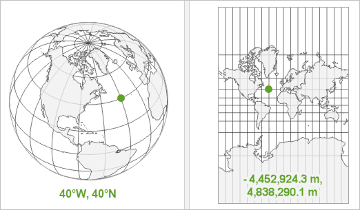
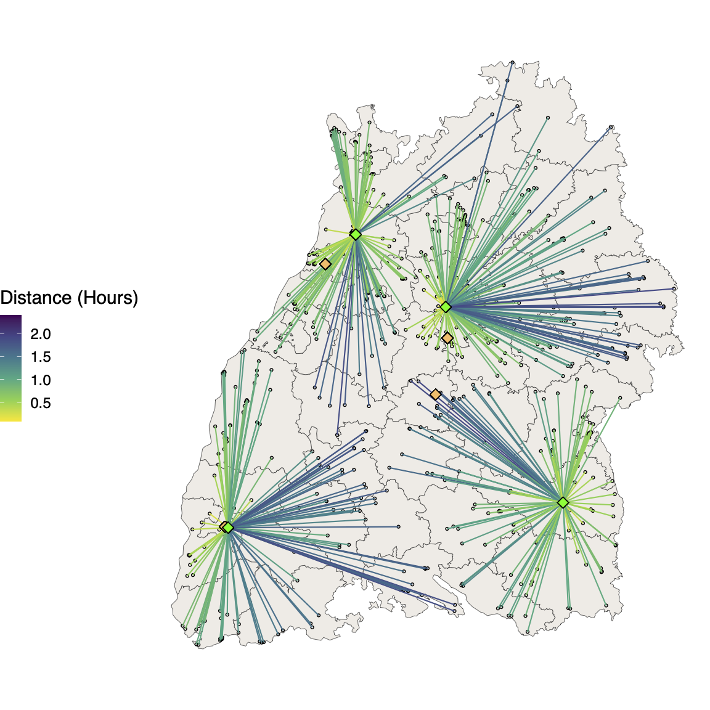
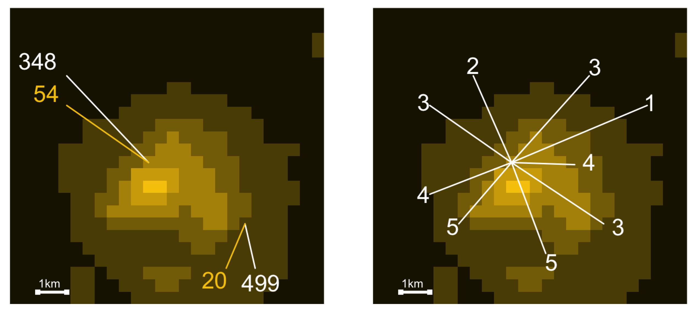

# Today's session {.centered}

**Lecture**

1.  Introduction to geospatial data
2.  Data acquisition and preparation
3.  Spatial Analysis

# 

\section{Introduction to geospatial data}

# Introduction to geospatial data

-   In political science we are used to working with cross-sectional or time-series cross-sectional data
-   But our observations are often not only rooted in time but also in space

# Example: Alabama

{width="50%"}

# Data types

1.  Vector data
2.  Raster

# Vector data

Consists of:

  1. Points
  2. Lines
  3. Polygons
    
# Vector data: Points

- Points map a singel observation to a location
- Are expressed as x,y coordinates (longitude, lattitude)

# Vector data: Points Example 
```{r echo=FALSE, message=FALSE, warning=FALSE}
require(ggmap)

start <- geocode("Oettingen Straße 67, München")

muc <- ggmap(
  get_map(
                "Oettingen Straße 67,München", 
                zoom = 12,
                mapRef = 84,  
                size=c(640,640),
                scale=2,
                maptype ="roadmap")
)


muc +
  geom_point(aes(x=lon, y=lat),
             color="yellow",
             data=start, 
             size=10)

```

# Vector data: Lines and Polygons

- Lines and polygons are a sequence of connected points
- Lines are open (e.g. streets or train lines) 
- Polygons are closed (e.g. country borders)

# Raster data

- Continuous surfaces
- Created by dividing spaces into equal sized cells

# Example: Raster data
```{r echo=FALSE, eval=T, warnings=FALSE}
load("~/intro-css-ws22/05/res/raster.Rdata")
g1 <- muc +
  geom_tile(aes(x = lon, y = lat,
                fill = fastest),
            data = raster,
            alpha = 0.5) +
  scale_fill_viridis_c(
    option = "magma",
    alpha = 0.8,
    begin = 0.1,
    end = 0.9,
    direction = -1
  ) +
  theme_void()+
  theme(legend.position = "bottom",
        legend.title = element_blank())+
  facet_wrap(~type)

g1
```

#
\section{Coordinate systems and projections}

# Definition

- Spatial data is defined in horizontal and vertical coordinate systems
- Horizontal: Locate data across the surface of the earth
- Vertical: Relative height or depth

# Horizontal

Horizontal coordinate systems can be one of three types:

- Geographic
- Projected (linear measurements)
- Local (relative local reference point)

# Horizontal: Geographic

- Units typical in decimal degrees 
- Degrees of longitude (x-coordinates) and degrees of lattitude (y-coordinates)
- Location expressed as positive or negative numbers 
- positive x and y for north of equator and east of prime meridan
- negative x and y for south of equator and west of prime meridan

# Geographic vs Projected

{width="100%"}

# Projections

- Projections are used to display the coordinate system and the spatiald data on a flat surface
- This *always* causes distortions
- See: https://www.thetruesize.com

#
\section{Example for data sources}

# Sources: Govermental data

- Vast amounts of spatial data is available directly from governmental sources
- This data often already very well prepared
- E.g. Census data, weather data ...


# Example:Govermental data

{width="30%"}

Source: 
https://www.thecgo.org/research/downwind-and-out-the-strategic-dispersion-of-power-plants-and-their-pollution/

# Sources: Geocoding from adresses

- Alternatively, often times we find data with associated addresses
- Addresses can be converted into spatial point data by geocoding it
- This can be done by using for example the Google Maps API

# Example: Drive time of environmental inspectors

{width="50%"}

# Sources: Satellite imaging

- Lastly spatial data can be extracted directly from satellite imaging

{width="100%"}

# 
\section{Spatial Analysis}

# Spatial autocorrelation

Idea: 
"Everything is related to everything else, but near things are more related than distant things” (Tobler,1970)

More precise:
“The property of random variables taking values, at pairs of locations a certain distance apart, that are more similar (positive autocorrelation) or less similar (negative autocorrelation) than expected for randomly associated pairs of random observations” (Legendre, 1993)

# Example: Spatial autocorrelation


# How to detect: Moran`s I

Are closer locations more similar than we would expect randomaly? 

$I = \frac{N \sum \sum w_{ij}(x_i - \tilde{x})(x_j-\tilde{x})}{ W \sum (x_i - \tilde{x})^2}$

# How to solve (one example): Spatial autogregressive models

1. We define a neighborhood matrix $W$
2. We lag the dependent variable $Y$ based on the weight matrix

Resulting model (SAR):

$Y = \beta_0 + \lambda WY + X\beta + \epsilon$ 

# Example: Neighborhood matrix


