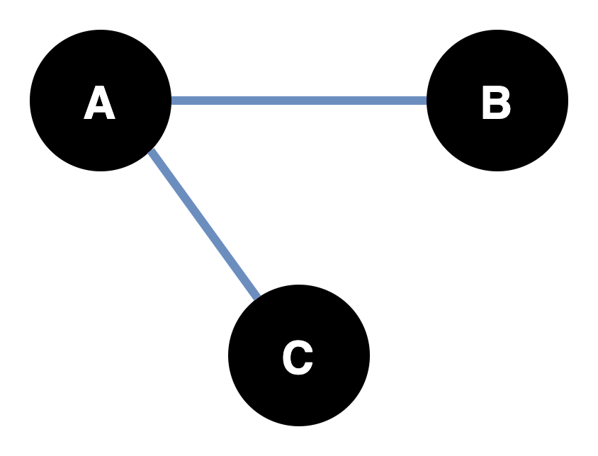
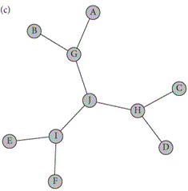

# Today's session {.centered}

**Lecture**

1. Basic concepts
2. Data collection and storage
3. Network measures
4. Applications in Political Science / CSS

**Lab**

1. Network basics in R
2. Twitter friendships of German MPs
3. Visualization

# Before we begin: Advent of Code

[**Advent of Code**](https://adventofcode.com/) is an annual set of computer programming challenges that have a Christmas-themed Advent calendar format.

&rarr; It's great for learning a new programming language!

Try it out if you like. Feel free to ask for help!

Derek Sollberger has created [tutorial videos](https://www.youtube.com/watch?v=C6bYLyUW4Vo) of how to solve the 2022 Advent of code in R.

# Before we begin: ChatGPT {.allowframebreaks}

**ChatGPT**

is a chatbot that responds to prompts and instructions developed by OpenAI [@brown_language_2020; @ouyang_training_2022].

\framebreak

\smaller

*Features / uses* (examples)

\vspace{-1em}

- Give explanations
- Write text
- Write code(!)

*Technology*

\vspace{-1em}

Generative transformer based (deep learning) text model (GPT-3.5) combined with Reinforcement Learning from Human Feedback

*Limitations*

\vspace{-1em}

- No independent reasoning
- Massive in size and probably not be free to use for long
- No open source code

See also https://openai.com/blog/chatgpt/

# <!----- SECTION: INTRO & BASICS ------>

\section{Introduction \& basic concepts}

# Networks around us i

::: {.centering data-latex=""}

{height=70%}

:::

\smaller
\smaller

Source: https://de.m.wikipedia.org/wiki/Datei:Netzplan_U-Bahn_M%C3%BCnchen.svg

# Networks around us ii

::: {.centering data-latex=""}

{height=70%}

:::

\smaller
\smaller

Source: It's Always Sunny in Philadelphia (Season 4 Episode 10)

# Networks around us iii

::: {.centering data-latex=""}

:::

# Introduction to networks in the Social Sciences

- Networks have a long tradition in science, mostly in Physics and Biology \pause
- In the *Social Sciences*, we are often interested in *social* networks

# Shy study networks?

{height=60%}

# Example overview of types of networked systems

::: {.centering data-latex=""}

{width=100%}

\smaller

Source: @jilbert_social_nodate

:::

# Research questions and goals of network analysis [@borgatti_analyzing_2013]

<!--- beginning of this https://www.youtube.com/watch?v=O-PF1PyQ8PA -->
<!--- borgaatti 2013 book ch 1 -->

\smaller

**Consequences of networks** &rarr; independent variable

*Example*

- How the position of an actor in a network shapes the actor's power 
- How a characteristic of a network influences actor behavior within the network

\pause

**Prediciton of network characteristics** &rarr; dependent variable

*Example*

- How actor preferences influence the actor's position in the network
- How one type of connection in a network (e.g. business ties) can influence the emergence of another type of connection (e.g. friendship)

# Example {.c}

<!-- https://www.youtube.com/watch?v=O-PF1PyQ8PA -->

**Six degrees of separation**

refers to the the separation of people by social connections (e.g. friends of friends).

It can be shown that in a random network of friendships between 6 billion people, two people are on average separated by roughly 6 'chained' friendships.

\pause

\vspace{0.5em}

*See also*

[Six degrees of Wikipedia](https://www.sixdegreesofwikipedia.com/)

[Six degrees of Kevin Bacon](https://oracleofbacon.org/)

# A simple network i

{height=90%}

# A simple network ii

{height=90%}

# A simple network iii

{height=90%}

# Nodes and edges

:::::::::::::: {.columns}

::: {.column }

{height=90%}

:::

::: {.column }

**Nodes** (also vertices) Entities or units in a network \pause

\vspace{1em}

**Edges** (also ties, links) Connections between nodes \pause

\vspace{1em}

&rarr; **Network**

:::

::::::::::::::

# Undirected edges

{height=90%}

# Directed edges

{height=90%}

# Symmetric and asymmetric relations

:::::::::::::: {.columns}

::: {.column }

**Undirected, symmetric relation**

\vspace{0.8em}

{height=90%}

:::

::: {.column }

\pause

**Directed, asymmetric relation**

\vspace{1.2em}

{height=90%}

:::

::::::::::::::

# Typology of relations between nodes

# One and two-mode networks

:::::::::::::: {.columns}

::: {.column }

**Text messaging among friends**

&rarr; one-mode network

:::

::: {.column }

\pause

**Hobbies among friends**

&rarr; two-mode network

:::

::::::::::::::

# Multiplexity

# Unconnected and maximally connected networks

:::::::::::::: {.columns}

::: {.column }

**Unconnected network**

\vspace{0.5em}

:::

::: {.column }

\pause

**Maximally connected network**

\vspace{0.5em}

:::

::::::::::::::

# Chains and trees

:::::::::::::: {.columns}

::: {.column }

**Chain**

\vspace{0.5em}

:::

::: {.column }

**Tree**

\vspace{0.5em}

:::

::::::::::::::

# Levels of analysis: network

::: {.centering data-latex=""}

{height=80%}

:::

# Levels of analysis: subgroup

::: {.centering data-latex=""}

{height=80%}

:::

# Levels of analysis: triad

::: {.centering data-latex=""}

{height=80%}

:::

# Levels of analysis: dyad

::: {.centering data-latex=""}

{height=80%}

:::

# Levels of analysis: ego

::: {.centering data-latex=""}

{height=80%}

:::

# Levels of analysis: ego and alter

::: {.centering data-latex=""}

{height=80%}

:::

<!---

# Social Network Theory and measurement

https://bookdown.org/omarlizardo/_main/1-3-the-two-faces-of-social-network-analysis.html#the-two-faces-of-social-network-analysis

Borgetti 2009:

Transmission

Adaption

binding

exclusion

-->

# <!----- SECTION: DATA COLLECTION & STORAGE ------>

\section{Network data collection and storage}

# What do we want to know? [@light_introduction_2021-1]

\smaller

**Ties** [@borgatti_network_2009]

- social relationships (e.g. friendship, kinship)
- interactions (e.g. sending and receiving messages, sharing resources)
- flows (spread of, e.g. ideas, diseases) &rarr; between nodes connected by relation or interaction ties

\pause

**Scope**

- Local networks (convenience samples)
- Complete / global networks

\pause

Complete networks are often unobtainable &rarr; *Sampling*

- Respondent-driven sampling &rarr; gain insights in network of hidden populations
- Network scale-up method &rarr; estimate the size hidden populations

# Boundary specification {.c}

**Boundary specification problem** "*In social networks boundaries can often logically extend to every human on the planet.*" [@light_introduction_2021-1]

\vspace{1em}

&rarr; Researchers need to specify the boundaries of the network they want to analyze

# How can we collect netowrk data? [@adams_strategies_2021]

**Collection via**

*Primary sources*

- Survey / Interviews

*Secondary sources*

- Information on individuals (e.g. archival sources)

*Hybrid sources*

- Sensor data / digital trace data / metadata

\vspace{0.5em}

+ text-corpora &rarr; Text networks

# Surveys / Interviews i

In surveys / interviews, we can ask respondents about their connections and relations to other entities. We can

- ask *open* or *closed* format questions \pause
- ask whether or not a relation exists \pause
- ask about the strength of relations \pause

# Surveys / Interviews ii

**Name generators**

- Example: "*Who do you contact if you get stuck with your work?*" \pause
- General Social Survey: "*From time to time, most people discuss important matters with other people. Looking back over the last six months, who are the people with whom you discussed matters important to you?*" &rarr; can be used to identify alters of an ego

\pause

&rarr; The exact name generator is determined by the research question

# Surveys / Interviews iii [@adams_strategies_2021]

**Name interpreters**

Ask additional questions on alters:

- attributes of the nominated alters
- details of the relationship
- strength or frequency of relationship

# Digital trace data / metadata {.c}

**Information on networks from**

- Monitoring of behavior (e.g. sensor data, app use log)
- Digital trace data (e.g. interaction on social media)
- Metadata (e.g. who cites whom, who follows whom)

# Ethics [@adams_strategies_2021]

**Data collection**

- Anonymity / Confidentiality &rarr; Problem: anonymized data can be used to deduct identities
- Informed consent
- Active consent / opt-out in population studies

\pause

**Analysis**

- Network visualization can reveal identities
- Balance between benefit and harm (e.g. infectious disease tracing)
- Network analysis use in business and management to assess performance

# How to store network data?

\pause

**Adjacency matrices**

\smaller

:::::::::::::: {.columns}

::: {.column }

*Undirected*

:::

::: {.column }

\pause

*Directed*

:::

::::::::::::::

\smaller
\smaller

Source (both): @light_introduction_2021-1

# <!----- SECTION: Network measures & models ------>

\section{Network measures and models}

# Social Network Analysis (SNA) {.c}

>Social Network Analysis (SNA) is the use of graph-theoretic and matrix algebraic techniques to study **social structure** and **social relationships**. [@jilbert_social_nodate]

# Graphs ands matrices

:::::::::::::: {.columns}

::: {.column }

**Graph**

\vspace{1em}

:::

::: {.column }

**Matrix**

\vspace{1em}

:::

::::::::::::::

\vspace{0.8em}

&rarr; Graphs and matrices are *mathematical* structures that can be used to model and make inferences about a network.

# Describing a graph: order

:::::::::::::: {.columns}

::: {.column }

**Order**

\vspace{1em}

&rarr; the number of nodes in a graph

:::

::: {.column }

\pause

\vspace{1em}

$n = |V| = 9$

:::

::::::::::::::

# Describing a graph: density

:::::::::::::: {.columns}

::: {.column }

**Density**

\vspace{1em}

&rarr; the relation of the number of *actual* edges in a graph to the number of *possible* edges in a graph

:::

::: {.column }

\pause

\vspace{1em}

\smaller

$n = |V| = 9$ \pause

$e = |E| = 9$ \pause

$\dfrac{e}{n(n-1)/2} = \dfrac{9}{36} = 0.25$

\vspace{0.2em}

\pause

\smaller
Note: for directed graphs maximum number of possible edges is given by $n(n-1)/1$

:::

::::::::::::::

# Note {.c}

**Notation and terms are not always used uniformly across different authors or disciplines.**

# Overview: levels and measures

Depending on the level of analysis, we might be interested in different properties of our network / nodes / relations.

\pause

- **Dyad** and **Triad** level &rarr; *structure* of the relations and whether or not a relation between nodes is *reciprocal* \pause
- Single (**Ego**) nodes &rarr; position within the network, such as it's *centrality*\pause
- **Subnetwork** level &rarr; *distance* between nodes\pause
- **Network level**
    - &rarr; groups within the network
    - &rarr; comparisons between networks (network properties, averages)
    
\pause

**Note: levels / measures are not mutually exclusive**

# Structural holes

**Structural holes** describe the absence of connections between two nodes that are connected through other nodes

\vspace{0.3em}

:::::::::::::: {.columns}

::: {.column }

{height=90%}
**Open**

:::

::: {.column }

\pause

{height=90%}
**Closed**

:::

::::::::::::::

\smaller

based on Fig. 4 from @borgatti_network_2009

\larger

\pause

\vspace{0.3em}

&rarr; can be used to infer, e.g. informational advantages of certain actors

# Paths and distance [@borgatti_three_2021]

:::::::::::::: {.columns}

::: {.column }

:::

::: {.column }

\smaller

\pause

**Path** refers to the 'way' in which two nodes are connected in a network &rarr; only adjacent nodes can be considered!

\vspace{1em}

\pause

**Distance** refers to the length (number of edges) of the shortest *path* between two nodes.

:::

::::::::::::::

&rarr; .e.g. useful to assess *centrality*

# Centrality overview [@borgatti_three_2021]

**Centrality** refers to the 'importance' or 'advantage' of the position of a node in a network.

There are multiple ways to define and approach centrality and, hence, different measures of centrality, e.g.

- *Degree centrality*
- *Betweenness centrality*
- *Closeness centrality*
- Eigenvector centrality
- PageRank

# Degree centrality

:::::::::::::: {.columns}

::: {.column }

:::

::: {.column }

***Degree centrality** refers to the number of edges a node has.*

\pause

\vspace{1em}

**Variants**

- *In- and outdegree centrality* (for directed networks)
- *Avg. degree*  (comparison between networks)

:::

::::::::::::::

# Betweenness centrality

:::::::::::::: {.columns}

::: {.column }

:::

::: {.column }

***Betweenness centrality** refers to the number of times a node is a 'bridge' on the shortest path between two other nodes.*

:::

::::::::::::::

# Closeness centrality

:::::::::::::: {.columns}

::: {.column }

:::

::: {.column }

***Closeness centrality** refers to the sum of the shortest paths to all other nodes in the network.*

:::

::::::::::::::

# Centrality and network structures

::: {.centering data-latex=""}

:::

\smaller

Source: @borgatti_network_2009

# <!----- SECTION: APPLICATIONS IN POLITICAL SCIENCE AND CSS ------>

\section{Networks, Political Science and CSS}

# @naidu_social_2021 {.squeeze}

\smaller
\smaller

**Social Origins of Dictatorships: Elite Networks and Political Transitions in Haiti**

How do social networks influence the organization of resistance to democracy?

**Theory**

- Social networks within groups of elites important for coordinating activities or spreading information
- Network position of individuals create variation in the amount of influence individuals can exert over others 
- The higher the centrality of an actor, the higher the incentive for a coup

**Network**

- Network of individuals based on firm-level data, business ownership data, and genealogical data
- Measure: Network centrality of individuals

**Results**

The higher the centrality, the more likely to participate in Coup attempts

# @wang_blood_2022 {.squeeze}

\smaller
\smaller

**Blood is Thicker Than Water: Elite Kinship Networks and State Building in Imperial China**

Under which conditions are kinship-based institutions compatible with state building?

**Theory**

- Geographically dispersed kinship networks cross-cut local cleavages and incentivize elites to unite in pursuit of national, rather than sectarian, goals
- Elites embedded in such dispersed networks can benefit from a strong central state, which generates scale economies in providing protection and justice throughout a large territory

**Network**

- (Geographic) politician kinship network based on tomb epitaphs from 11th century China
- Measure: Concentration of the network

**Results**

The lower concentration (more dispersed) a network, the higher support for state building

# @conover_political_2011

# Text networks

::: {.centering data-latex=""}

{height=75%}
:::

\smaller
\smaller

\vspace{-0.5em}

Source: https://towardsdatascience.com/text-network-analysis-theory-and-practice-223ac81c5f07

# Outlook

There are many concepts and aspects of (social) network analysis not covered in today's lecture. For example:

- Dynamic (temporal) networks
- Exponential random graphs
- Text networks
- Network experiments

# Reading {.c}

Today's reading [@borgatti_network_2009] can be found in the literature folder.

# Next session

\vspace{2em}

**Next session** 23 Jan 2023: Research design & workflow

\vspace{1em}

*Guest lecture: Franziska Quoß -- The impact of political business cycles on the environment*

#

\section{Lab}

# References  {.allowframebreaks}

\begingroup

\footnotesize
::: {#refs}
:::
\endgroup

# Appendix {.allowframebreaks}

